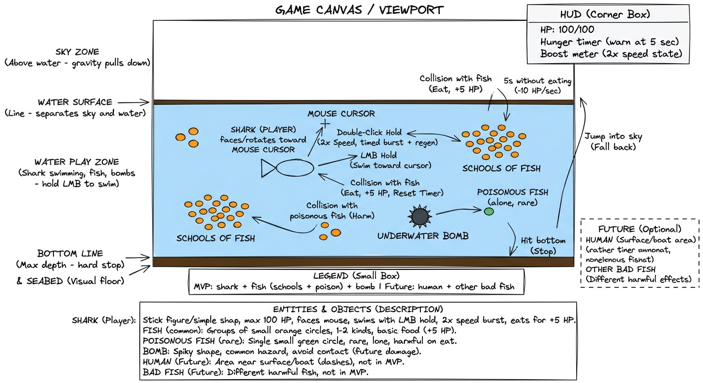

# Hungry Shark

A browser-based 2D underwater survival game built with **HTML, CSS, and vanilla JavaScript** — no libraries, frameworks, or game engines.

**Full design spec:** [docs/project-design.md](docs/project-design.md)

---

## Game Description

You control a hungry shark in a dynamic ocean ecosystem. Swim through an unbounded world, hunt **schools of fish** to stay fed and build score, and avoid hazards. The camera follows you as you explore — new fish groups appear ahead as you move. Survive as long as you can before hunger or damage ends the run.

The playfield is a camera viewport into world coordinates divided into zones from top to bottom:

| Zone | Description |
|------|-------------|
| **Sky** | Above the water surface. Shark can enter; no gravity in current scope. |
| **Water surface line** | Boundary between sky and the main play area. |
| **Water zone** | Light-blue main play area — shark, fish schools, and hazards live here. |
| **Seabed** | Dark-brown floor at the bottom. Hard stop for downward movement. |

### Entities

| Entity | Type | Behavior |
|--------|------|----------|
| **Shark** | Player | Rotates toward mouse; swims on LMB hold; boost on double-click (meter-based). HP 0–100. Status tints: light red (starving), light green (poisoned). |
| **Common fish** | Consumable | Orange mini-sharks in **groups** that spawn together and disperse. Eaten fish are **gone** — new groups appear as the shark explores. Feeding resets hunger and earns strike score. |
| **Poisonous fish** | Hazard | Green solo fish (small count). **20 HP over 4 seconds** (DOT), not instant. Light-green shark signal while poisoned. |
| **Underwater bomb** | Hazard | Dark spiky circle. Explosion VFX, −30 HP, respawns after delay. *(Current implementation — unchanged.)* |
| **HUD** | UI overlay | Top-right: HP bar (red), boost bar (dark blue), golden score, settings menu. |

**Future scope (not in MVP):** humans at the surface, aggressive predator fish.

### Game Sketch (Excalidraw)



---

## How to Play

### Controls

| Input | Action |
|-------|--------|
| **Mouse move** | Shark rotates to face the cursor |
| **Left mouse button (hold)** | Swim forward along current angle toward the cursor |
| **Double-click** | Activate boost (drains boost meter while in use) |

### Objective

Hunt common fish schools to reset hunger and rack up **strike score**. Chain eats within 2 seconds to double each bonus (5 → 10 → 20 → …). Avoid poisonous fish and underwater bombs.

### Win / Lose

| Outcome | Condition |
|---------|-----------|
| **Win** | No fixed win state — maximize score through efficient school hunting. |
| **Lose** | HP drops to 0 from starvation, poison, or bomb damage. Game Over overlay shows final score. |

### Hunger & HP

**Starvation:** no common fish within **10 seconds** → **−5 HP/sec** (light red signal).

**HP regen:** no instant heal on eat. Regen **+10 HP/sec** starts only after **2 seconds** with no starvation, no active poison, and no HP loss (bombs, poison ticks, or starvation). Cap: 100 HP.

### Strike Scoring

| Rule | Value |
|------|-------|
| First fish in a chain | +5 points |
| Each next fish (within 2s) | Previous bonus × 2 |
| Chain expires | After 2 seconds without eating |

Example: hunting an 8-fish school without breaking chain → 5 + 10 + 20 + 40 + 80 + 160 + 320 + 640.

### Boost

Double-click toggles boost (2× speed). Meter drains **only while boosting** and stops when boost is off. After **2 seconds** idle, meter regenerates from empty to full in **10 seconds**.

### HUD & Settings

Top-right overlay: red HP bar, dark blue boost bar (no numeric HP), golden score below. Settings (⚙) offers Continue, Restart, and a mock Turn off music toggle. Best score removed from in-game HUD only; kept on start and game-over screens.

**Full spec:** [docs/project-design.md](docs/project-design.md) — changelog (§0), rules (§3), HUD (§4), implementation checklist (§7), testing checklist (§8).

---

## Tech Decisions

**Approach: hybrid OOP + functional** (see [docs/project-design.md §5](docs/project-design.md#5-technical-architecture--loop-design))

| Layer | Style | What |
|-------|-------|------|
| **Entities** | OOP | `Shark`, `Fish`, `Bomb` classes — own position, state, and `.draw(ctx)` |
| **Systems** | Functional | Input, collision (`checkCollision`), timers, game state, `requestAnimationFrame` loop |

**Why hybrid:** Entities naturally bundle their data and rendering. Shared systems stay decoupled — no deep inheritance, easy to add new entity types without rewriting the loop.

### Game loop (each frame)

1. Clear canvas (`ctx.clearRect`)
2. Process input (mouse position, click states, boost)
3. Update physics & logic (movement, hunger/poison DOT, strike chain, fish groups, boost meter)
4. Evaluate collisions
5. Render (background, entities, top-right HUD)

---

## AI Development Log

Prompt details live in [`prompts/`](prompts/). The diary indexes them:

**[AI_DIARY.md](AI_DIARY.md)**

---

## Live Demo

**GitHub Pages:** [https://anonimprogrammer.github.io/hungry-shark/](https://anonimprogrammer.github.io/hungry-shark/)

---

## Known Bugs / What I'd Fix Next

_Design spec updated — implementation catching up._

- [x] Scaffold `index.html`, canvas, and main game loop
- [x] Implement `Shark` boost state machine (2× speed on double-click)
- [x] Spawn fish schools and underwater bomb
- [x] Add collision detection (shark ↔ fish, shark ↔ bomb)
- [x] Add HP / hunger mechanics and survival score
- [x] Start screen and game over screen
- [x] Game restart without page refresh
- [x] Dynamic world with camera follow
- [ ] **Enhanced rules (design complete)** — see [implementation checklist](docs/project-design.md#7-implementation-gap-checklist)
- [ ] Fish groups without individual respawn; spawn ahead of shark
- [ ] Strike-based scoring with 2s chain window
- [ ] Poison DOT (4s) and status tints (light green)
- [ ] Updated hunger (10s / −5 HP/sec) and HP regen (+10/s after 2s clear of starve/poison/damage)
- [ ] Boost meter drain/regen (2s delay, 10s refill, stoppable)
- [ ] Top-right HUD bars + settings menu; best score off HUD only (keep on start/game-over)

---

## Project Structure

```
hungry-shark/
├── docs/
│   └── project-design.md       # Full game design blueprint
├── prompts/                    # Detailed AI prompt logs
├── AI_DIARY.md                 # AI diary index
├── hungry_shark_excalidraw.png # Excalidraw sketch
├── index.html
├── css/
│   └── style.css
├── src/
│   ├── config/
│   ├── domain/
│   ├── engine/
│   └── index.js
└── README.md
```

## Stack & Constraints

| Allowed | Not allowed |
|---------|-------------|
| HTML, CSS, vanilla JS | jQuery, Three.js, Phaser, Pixi.js |
| Canvas API, DOM manipulation | Tailwind, Bootstrap, CSS frameworks |
| Free AI tools | Paid AI plans / API keys |

---

Ironhack bootcamp — individual project.
